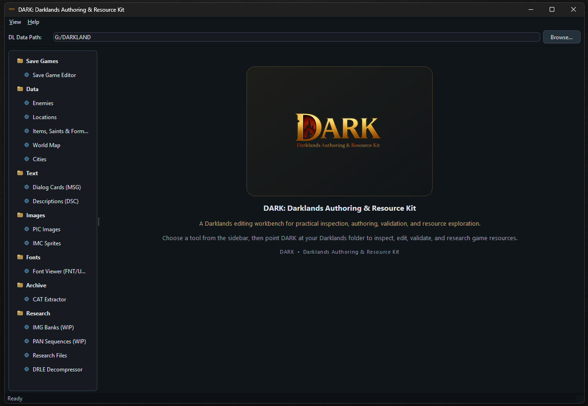
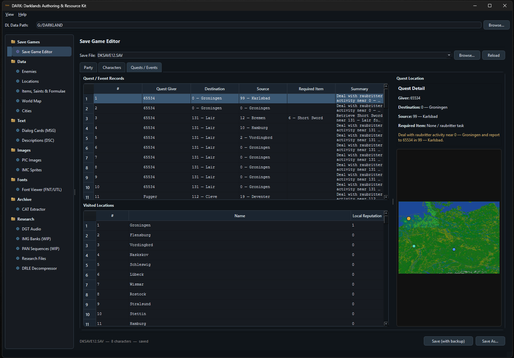
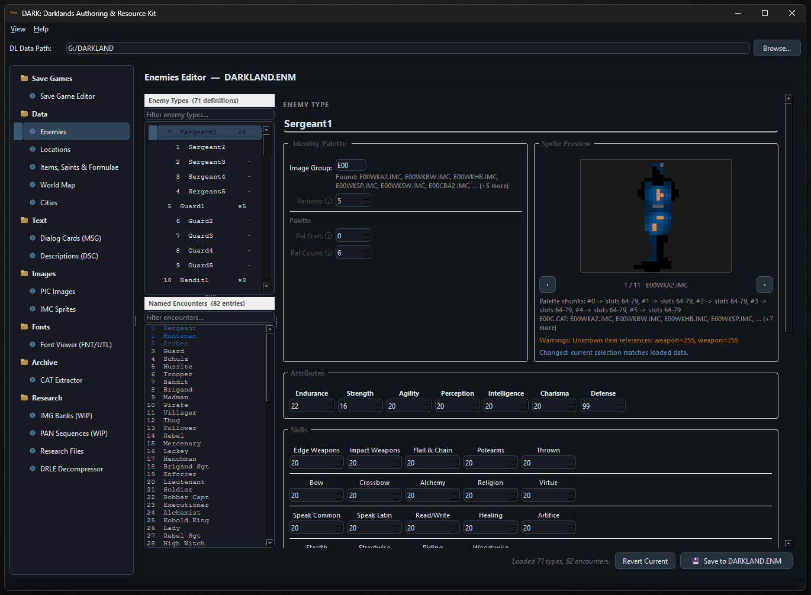
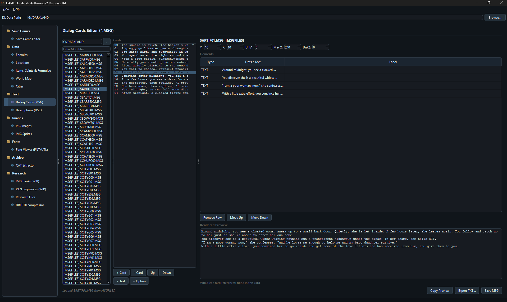
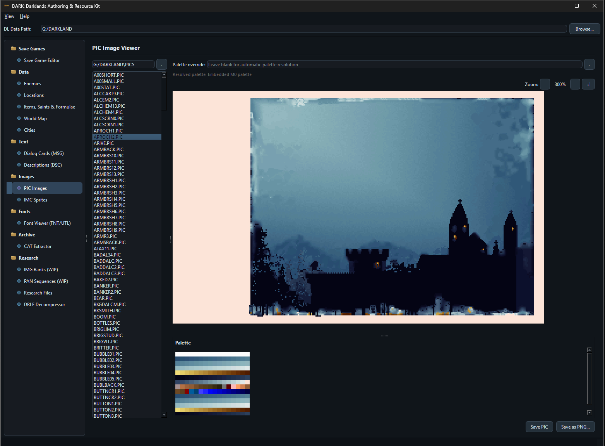
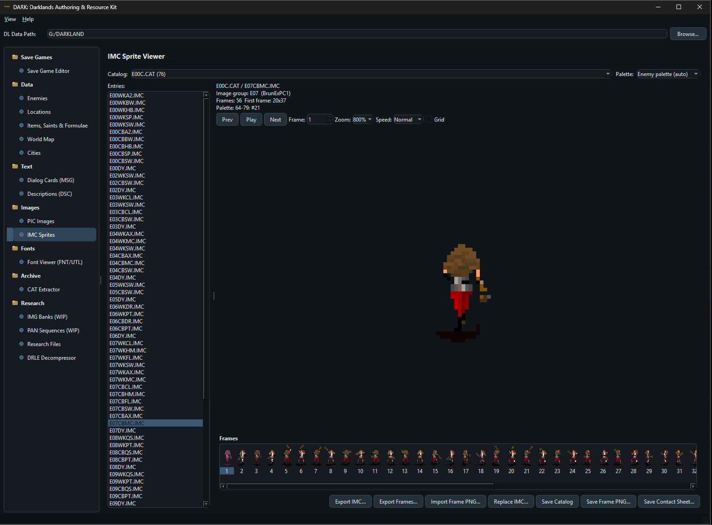
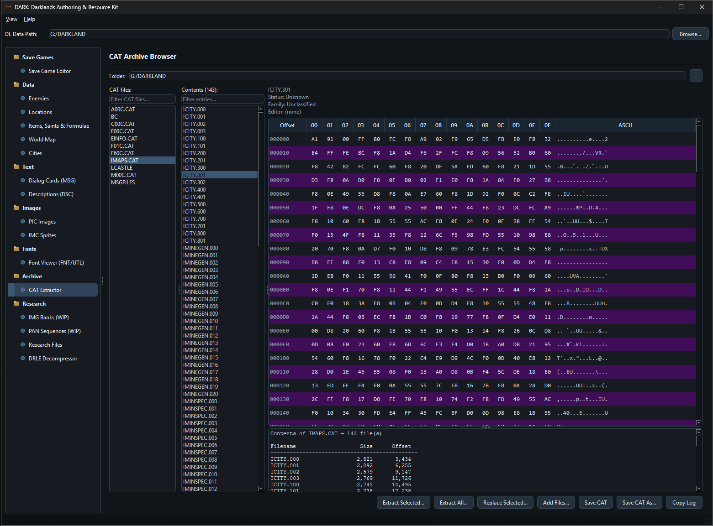
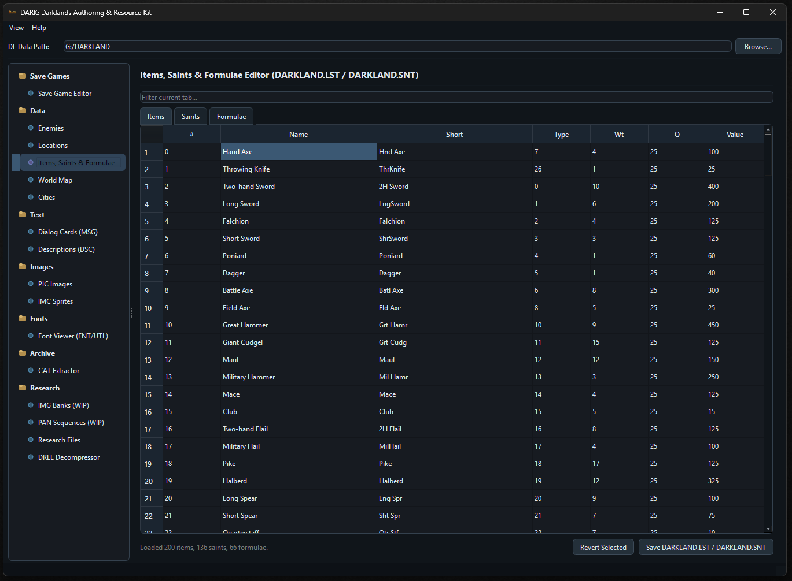
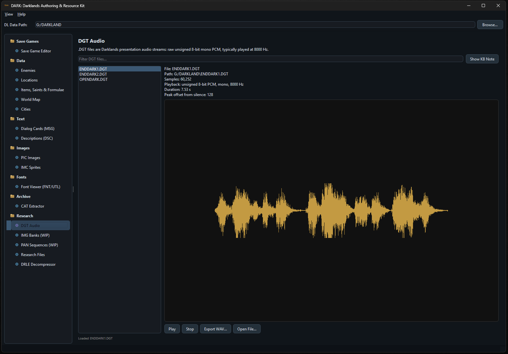

# DARK: Darklands Authoring & Resource Kit

Desktop workbench for inspecting, editing, validating, and researching **Darklands** data files.

## What DARK Does

DARK is built to make Darklands format work practical in one place instead of scattering it across one-off scripts and notes.

Current scope includes:
- save files
- world data: cities, locations, descriptions, items, saints, formulae, enemies
- dialog cards and `MSGFILES`
- `PIC` images and `IMC` tactical sprites
- font editing
- `CAT` archive browsing and rebuilding
- validation, coverage, and research-oriented tooling

## Screenshot Gallery

| Tool | Preview |
|------|---------|
| Save editor |  |
| Enemy editor |  |
| Message editor |  |
| PIC viewer |  |
| IMC viewer |  |
| Archive browser |  |
| Item / saints / formulae editor |  |
| DGT audio tool |  |

## Status

This project is currently **0.9b2**.

Large parts of the app are already useful, but some areas are still experimental or under active research. In particular, some file families are supported only partially, and research-oriented placeholders still exist for formats that are not yet fully integrated.

## Safety

This is an experimental reverse-engineering and modding tool.

- Back up your Darklands files before editing anything.
- Prefer working on a duplicate install, not your only clean copy.
- Test small changes often.

The app creates backups in some workflows, but your own manual backup is still essential.

## Running DARK

For packaged builds:
- use the Windows release zip / executable
- no separate Python install should be required for the packaged app

For source use:
1. Install Python 3.
2. Install dependencies from `requirements.txt`.
3. Run `main.py`.

## Repository Layout

- `app/` - UI, editors, dialogs, validation, theming
- `vendor/darklands/` - file-format readers/writers and format helpers
- `screenshots/` - app screenshots for documentation
- `docs/` - project notes and reports

## Releases

Source lives in this repository.

Release builds are intended to be distributed through GitHub Releases as versioned zip packages.

The included `README.txt` is kept as the packaged distribution readme for release archives.

## Credits

- Merle
- Joel "Quadko" McIntyre
- M. Gutsohn (Nurnberg project), for additional file-format information
- The whole Darklands Yahoo Group

Dedicated to the memory of Arnold Hendrick.

## Disclaimer

DARK is not affiliated with the original creators or rights holders of Darklands.

It is a community reverse-engineering, preservation, and modding tool built around public format knowledge and ongoing research.
